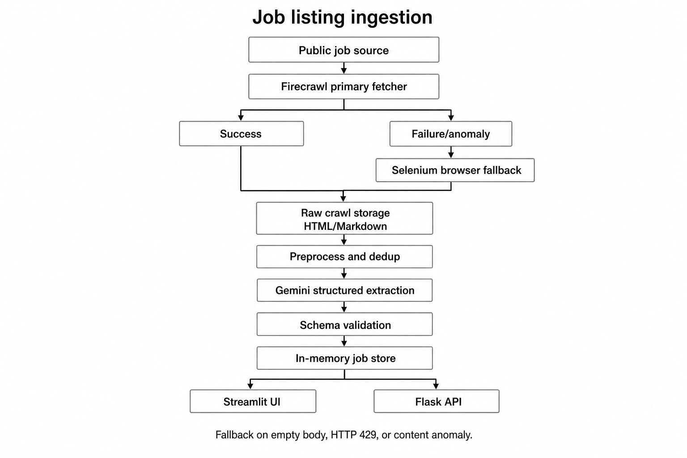

# Job Listing Ingestion — Design Document

**Project:** Acdyon Part 1 — Getting Data Out of a Platform That Doesn't Want You To  
**Author:** Ashish Tomer  
**Live demo:** [https://acdyon-project-production.up.railway.app/](https://acdyon-project-production.up.railway.app/)  
**GitHub:** [https://github.com/ASHISHTOMER0817/acdyon-project](https://github.com/ASHISHTOMER0817/acdyon-project)

---

## Scope guardrail (how the demo respects the brief)

> Run the live demo against **one low-risk source** — a public job-board RSS/API, or a sandbox you control — not a live LinkedIn account.

**Our chosen demo source:** [https://www.foundit.in/search/customer-support-jobs?start=1&limit=20&query=customer+support&experienceRanges=0%7E0&jobCities=Amritsar](https://www.foundit.in/search/customer-support-jobs?start=1&limit=20&query=customer+support&experienceRanges=0%7E0&jobCities=Amritsar)

**What we are *not* doing in the live demo:**

- No logged-in scraping on LinkedIn, Indeed, Naukri, or Wellfound — no account credentials, session cookies, or identity reuse.
- No CAPTCHA solving, challenge bypass, or “click-the-traffic-light” automation.
- No login-wall bypass or paywall circumvention.
- No proxy / IP / fingerprint rotation to evade blocks — we pace a single polite client instead of scaling aggression.
- No increasing request volume after a **429** or rate limit.
- No Selenium on Railway (no Chrome in the container) — the live deploy uses Firecrawl or a single HTTP GET; Selenium exists locally as a documented fallback path only.
- No storing scraped data in a persistent database — process memory for the demo; objects reset on redeploy.

---

## 1. Detection surface

**Question:** What specifically gives an automated client away on a site like LinkedIn, Indeed, Naukri, or Wellfound (headless fingerprints, request timing, missing headers, behavioral patterns)? Which of those does our design account for?

Anti-bot systems on major job boards typically score clients across four layers:

**Browser / client signals.** Headless Chrome leaks fingerprints: `navigator.webdriver`, missing plugins, uniform viewport, WebGL/Canvas hashes, automation flags in CDP, and inconsistent JS execution. Real users run full browsers with varied hardware and extensions.

**Network and timing signals.** Burst traffic from one IP, perfectly regular intervals, zero think-time between page loads, and immediate pagination through search results stand out. Sustained 429 responses followed by *more* requests is a common ban trigger.

**Header, TLS, and reputation signals.** Missing or static `User-Agent`, absent `Accept-Language`, no referrer chain, datacenter IP ranges, and low IP reputation all raise scores before HTML is even parsed.

**Behavioral signals.** Bots jump straight to API/search URLs, never load assets, skip mouse/scroll events, and don’t dwell on pages. Account-based platforms also correlate session age, login patterns, and graph behavior.

**What our pipeline accounts for today:**

| Signal class | Our response |
|---|---|
| Request timing | Minimum interval between outbound requests (`MIN_REQUEST_INTERVAL_SECONDS`, default 1.5s); exponential backoff on retries; **never** ramp up after 429 |
| Transport failure / empty body | Treated as anomaly, not success — triggers Selenium fallback locally |
| Content sanity | `CrawlValidator` rejects empty, tiny, or marker-less bodies even on HTTP 200 |
| Headless fetch quality | Firecrawl as primary (managed fetch + markdown); Selenium fallback uses real Chrome locally, not a custom evasion stack |
| Operator visibility | Health metrics and Streamlit surface degraded/down state instead of silent empty runs |

**What we deliberately do *not* address:**

| Signal class | Why not |
|---|---|
| Fingerprint spoofing / stealth plugins | Out of scope — evasion arms race; conflicts with our ToS line |
| IP / proxy / identity rotation | Out of scope — masks blocks instead of respecting them; high operational and legal risk |
| CAPTCHA / login-wall bypass | Hard stop by design — pipeline returns failure and waits for operator |
| Human-behavior simulation | Not implemented — we rely on pacing and public/low-friction URLs instead |

The demo proves the **ingestion pattern** (fetch → validate → extract → store) on a public Foundit search URL via Firecrawl/HTTP, not a bypass of LinkedIn-grade bot detection.

---

## 2. Ingestion strategy

**Question:** How do we pull data while staying under the radar — rotation, pacing, session/identity management, fallback when a source starts blocking mid-run? What is plan B when the primary approach gets shut down in a week?

**Primary path:** `FirecrawlCrawler` scrapes the target URL to HTML + Markdown when `FIRECRAWL_API_KEY` is set. If Firecrawl is unset or returns unusable content, a **single polite HTTP GET** fetches the page directly.

**Content gate before extraction:** Every fetch passes `CrawlValidator` — HTTP status, body size, and coarse job-related markers must pass. HTTP 200 with an empty or irrelevant body is an **anomaly**, not a success.

**Fallback path:** If the primary fetch fails transport checks or content validation, `SeleniumCrawler` loads the URL in headless Chrome (local/dev only). If Selenium hits a CAPTCHA or access challenge, it **stops** and returns an error — no retry loop against the wall.

**Pacing and backoff:** `IngestionService._pace()` enforces a minimum gap between outbound requests. Retries use exponential backoff capped by `MAX_RETRIES`. A **circuit breaker** opens after `CIRCUIT_FAILURE_THRESHOLD` consecutive failures (default 3) — further ingests are rejected until cooldown/reset rather than hammering the source.

**429 / rate limits:** Recorded as content anomalies. The client backs off and may try Selenium once; it **never** increases request frequency after a limit.

**Rotation:** Not in scope. One identity, one IP, one user-agent per run. Rotation is reserved for a future multi-tenant production system with explicit legal approval — not this demo.

**Plan B (primary crawler blocked or degraded):**

1. Selenium fallback on anomaly (where Chrome is available).
2. Circuit opens → operator sees degraded health in Streamlit.
3. Operator changes `DEFAULT_SOURCE_URL` to another public source (e.g. RemoteOK JSON API, RSS feed) — only the crawler adapter changes.
4. Raw crawl is stored in memory so Gemini extraction can be **re-run without re-fetching**.

**Plan C (source dies entirely):**

- Switch to an official API or partner feed where available.
- Alert operator; pipeline marks source **down**, not silent zero.
- Per-source adapter isolation in `app/crawlers/` — core orchestration unchanged.

**Demo source choice:** Foundit search is a public listing page fetched without login. It exercises the full pipeline (Firecrawl → validate → Gemini → Streamlit) while staying inside the assessment guardrail — no LinkedIn account, no CAPTCHA bypass, no burned credentials.

---

## 3. Resilience

**Question:** The source changes markup overnight, rate-limits you, or returns an empty response. What keeps the pipeline running instead of silently failing?

**Bad / empty / anomalous responses:** `CrawlValidator` checks beyond HTTP status — empty body, response under 80 bytes, or no job-related markers (`job`, `hiring`, `company`, etc.) all flag **anomaly**. An anomalous primary fetch triggers Selenium fallback; if both fail, `IngestReport.ok = False` with an explicit message — nothing is extracted or stored as if it succeeded.

**Markup or schema change:** We do **not** rely on brittle CSS/XPath selectors for job fields. Gemini converts crawled Markdown/text into structured JSON `{ "jobs": [ ... ] }`. When Foundit rearranges HTML, extraction still works as long as job text is present in the body. If markup change returns empty/challenge pages, the content validator catches it before Gemini runs.

**Rate limit or transport failure:** HTTP 429 → anomaly → backoff + optional Selenium. Repeated failures increment `consecutive_failures`; at threshold the **circuit opens** and further ingests stop with a clear error. Health service records fetch latency, status, and fallback usage.

**Invalid Gemini objects:** Each object is validated (`title`, `company`, `source_url` required) by `JobValidator`. Invalid objects are **rejected, counted, and not stored**. The ingest report shows `extracted / inserted / duplicates / invalid` so a run that parsed 10 but saved 0 is visible.

**Avoiding silent failure:**

- `IngestReport` returned to Streamlit with success/failure message.
- `HealthService` tracks source status: `healthy` → `degraded` → `down`.
- Duplicate-only runs still report `ok=True` with duplicate count — “zero new jobs” is distinguishable from “fetch failed”.
- Raw crawls persisted in `CrawlRepository` for re-extraction without a new fetch.

**Degraded vs hard stop:**

| State | Meaning | Pipeline behavior |
|---|---|---|
| **Degraded** | Fetch or extraction partially failed; some data may exist | UI shows warning; operator can retry or switch source |
| **Hard stop (circuit open)** | Too many consecutive failures | No further fetches until cooldown/reset; explicit error to operator |
| **CAPTCHA / challenge** | Selenium detected a wall | Immediate stop; no bypass attempt |

**Production additions (not in demo):** PostgreSQL for crawls and jobs, dead-letter queue for failed extractions, PagerDuty/Slack alerting on circuit open, structured retry schedules per source, and schema-versioned extractors as a Gemini fallback.

---

## 4. Where we'd stop

**Question:** Every platform here has terms of service against scraping. Where is our personal and technical line, and how does the design respect it while still getting the job done?

### Sub-questions to answer

- Which sources / actions are **in scope** for a real system vs **out of scope**?
- What do we **never** do (CAPTCHA solving, credential stuffing, login-wall bypass, etc.)?
- How does the **demo source** choice align with ToS and the scope guardrail?
- What is our line on **personal data** and **account-based** scraping?
- If a source shows a login wall or CAPTCHA, what does the pipeline do?
- How would we prefer to ingest **legitimately** where possible (official API, partner feed, RSS)?

### Response

_[TBD]_

---

## Architecture diagram



```
Public source (Foundit search URL)
    → Firecrawl (primary) or polite HTTP GET
        → content/transport validation (CrawlValidator)
            → Selenium fallback if empty / 429 / anomaly  [local only]
    → Raw crawl stored in process memory
    → Clean + fingerprint / dedup
    → Gemini structured extraction
    → Schema + business validation
    → Job objects stored in runtime memory
    → Streamlit UI (print as-is + ✕ delete)
```

---

## Cross-reference to implementation

| Design topic | Code / doc reference |
|---|---|
| Fetch + fallback | `app/crawlers/`, `app/clients/` |
| Pacing + circuit breaker | `app/config/settings.py`, `app/services/ingestion_service.py` |
| Extraction resilience | `app/extractors/gemini_extractor.py` |
| Validation + no silent store | `app/validators/` |
| Operator visibility | `streamlit_app.py`, `app/services/health_service.py` |
| Existing notes | `job-ingestion/docs/architecture.md`, `job-ingestion/docs/ingestion-strategy.md` |
